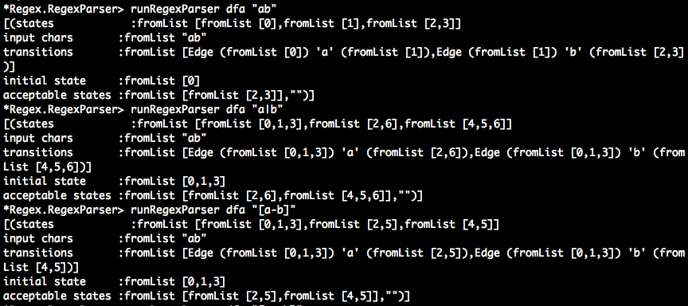

# Haskell-Re
Yet another regular expression engine implementation in Haskell

### Build
```bash
$ stack build
```

### Features
support:

`?` The question mark indicates zero or one occurrences of the preceding element. For example, colou?r matches both "color" and "colour".

`*` The asterisk indicates zero or more occurrences of the preceding element. For example, ab\*c matches "ac", "abc", "abbc", "abbbc", and so on.

`+` The plus sign indicates one or more occurrences of the preceding element. For example, ab+c matches "abc", "abbc", "abbbc", and so on, but not "ac".

`[]` A bracket expression. Matches a single character that is contained within the brackets. For example, [abc] matches "a", "b", or "c". [a-z] specifies a range which matches any lowercase letter from "a" to "z". These forms can be mixed: [abcx-z] matches "a", "b", "c", "x", "y", or "z", as does [a-cx-z].

`[^]` Matches a single character that is not contained within the brackets. For example, [^abc] matches any character other than "a", "b", or "c". [^a-z] matches any single character that is not a lowercase letter from "a" to "z". Likewise, literal characters and ranges can be mixed.

`()` Defines a marked subexpression. The string matched within the parentheses can be recalled later (see the next entry, \n). A marked subexpression is also called a block or capturing group.

### Internal Automata
DFA:


### TODO
#### Most important
improve the speed!

`{m, n}` Matches the preceding element at least m and not more than n times. For example, a{3,5} matches only "aaa", "aaaa", and "aaaaa". This is not found in a few older instances of regexes.

`$` Matches the ending position of the string or the position just before a string-ending newline. In line-based tools, it matches the ending position of any line.
